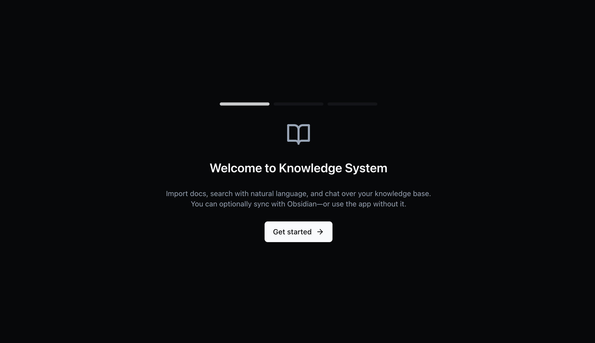
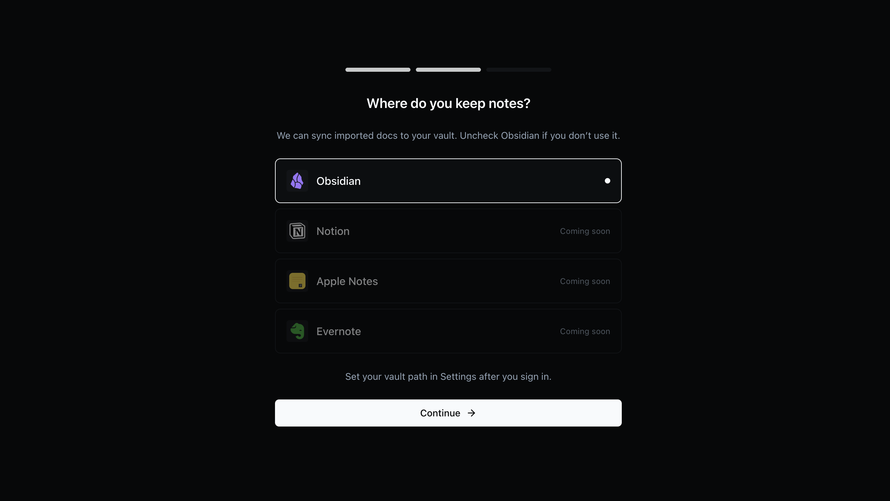
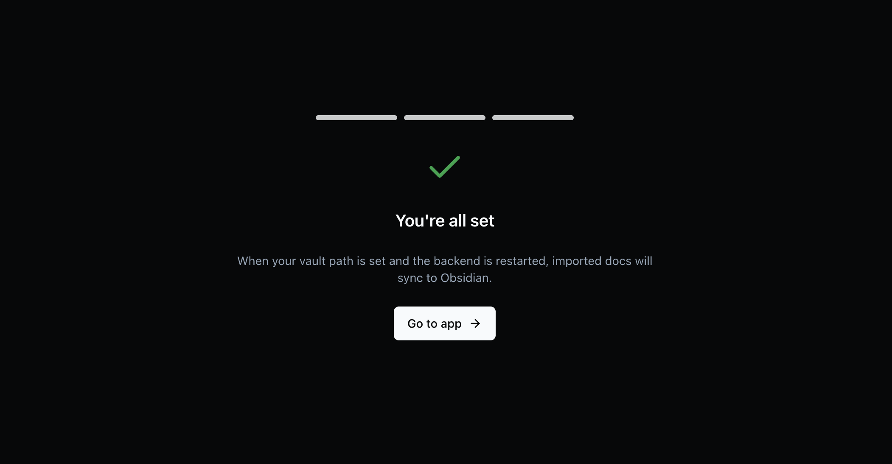
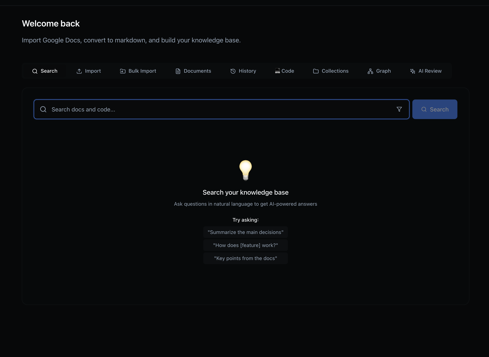

# Knowledge System

Import Google Docs (and other sources), search and chat over your docs with vector search and RAG. Optionally sync imported docs to an Obsidian vault.

**Stack:** FastAPI backend, Next.js frontend, SQLite + ChromaDB, Google OAuth.

## Prerequisites

- Python 3.11+
- Node.js 18+
- **Google OAuth credentials** – required for sign-in and importing Google Docs. Anyone who clones and runs the app needs their own. Create a [Web application OAuth client](https://console.cloud.google.com/apis/credentials) and add redirect URI `http://localhost:3000/api/auth/callback/google`; copy Client ID and Client secret into `frontend/.env.local` (see below).
- **Obsidian** – optional. If you use Obsidian, set `OBSIDIAN_VAULT_PATH` in backend `.env` to sync imported docs to your vault. If not, the app still runs: search, chat, and doc review work without a vault.

## Setup

**1. Backend**

```bash
cd backend
python -m venv venv
source venv/bin/activate   # Windows: venv\Scripts\activate
pip install -r requirements.txt
cp .env.example .env
# Edit .env: GOOGLE_CLIENT_ID, GOOGLE_CLIENT_SECRET, SECRET_KEY (required).
# Optional: OBSIDIAN_VAULT_PATH (absolute) to enable vault sync; leave empty to run without Obsidian.
uvicorn app.main:app --reload --port 8000
```

**2. Frontend**

```bash
cd frontend
npm install
cp .env.example .env.local
# Edit .env.local: GOOGLE_CLIENT_ID, GOOGLE_CLIENT_SECRET (same or separate OAuth client), NEXTAUTH_SECRET, NEXTAUTH_URL
npm run dev
```

**3. Run**

Open http://localhost:3000. New users see a short **onboarding** (e.g. “Do you use Obsidian?”). Then sign in with Google. After sign-in you can import Google Doc URLs, search, and chat. If Obsidian is configured, imported docs are written to your vault under `VAULT_ROOT_FOLDER` (default `Knowledge`).

**Run both from one terminal:** `./run.sh` (starts backend and frontend; Ctrl+C stops both). Do `backend/venv` and `npm install` in `frontend` first.

## Config

- **Google OAuth** – `GOOGLE_CLIENT_ID` and `GOOGLE_CLIENT_SECRET` in both `backend/.env` and `frontend/.env.local`. Frontend uses them for sign-in (NextAuth); backend uses them for Google Docs/Drive import. You can use one OAuth client for both, or separate clients.
- **Obsidian (optional)** – `OBSIDIAN_VAULT_PATH` in backend `.env` (absolute path). Leave empty to disable vault sync.
- **PDF image extraction (optional)** – `PDF2MD_PATH` in backend `.env`: path to [pdf2md](https://github.com/bugkill3r/pdf2md) CLI for extracting images from Google Docs exported as PDF. Leave empty to skip image extraction.
- `VAULT_ROOT_FOLDER` – subfolder inside the vault (default `Knowledge`)
- `PROJECT_NAME` / `NEXT_PUBLIC_APP_NAME` – app title
- See `backend/.env.example` and `frontend/.env.example` for the full list.

## Project layout

- `backend/` – FastAPI app, services (import, document, embedding, AI), API routes
- `frontend/` – Next.js app, onboarding, dashboard (import, documents, search, collections, code, graph, review)
- `docs/` – context-oriented notes (e.g. [Context is all you need](https://www.mishras.xyz/posts/context-is-all-you-need)):
  - **CONTEXT.md** – Where to look, conventions, one-page orientation
  - **UNDERSTANDING.md** – Architecture, config, flows, key files

No org-specific branding in code. Set `PROJECT_NAME` and `NEXT_PUBLIC_APP_NAME` for any team or project.

---

## Screenshots

**Onboarding**







**Dashboard**



